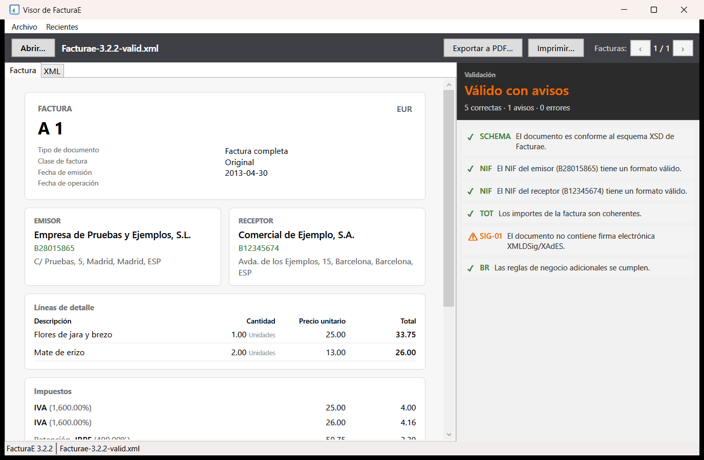
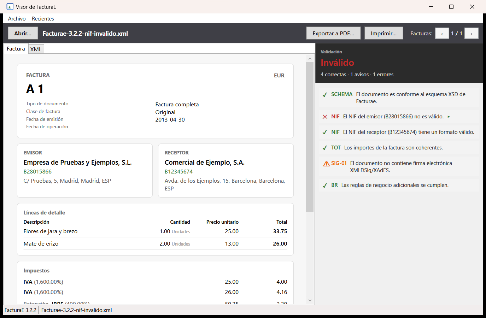

# Guía de uso del Visor de FacturaE

El **Visor de FacturaE** es una aplicación de escritorio para Windows que abre,
valida y visualiza facturas electrónicas españolas en formato **FacturaE**
(fícheros `.xsig`, `.xpsig` y `.xml`).

## Abrir un fichero

Hay tres formas de abrir una factura:

1. **Doble clic** en un fichero `.xsig`, `.xpsig` o `.xml` asociado a la aplicación
   (la asociación se registra al instalar).
2. **Menú Archivo → Abrir…** o el botón **Abrir…** de la barra de herramientas.
3. **Arrastrar y soltar** el fichero sobre la ventana de la aplicación.

También puede pasarse la ruta como argumento de línea de comandos:

```
FacturaeViewer.exe [fichero.xsig]
```

Al abrir un fichero mientras otra instancia ya está en marcha, la ruta se entrega
a la ventana ya abierta (aplicación de instancia única).

## Ventana principal



La ventana se divide en dos zonas:

- **Izquierda:** la factura en formato legible, organizada en cabecera, emisor y
  receptor, líneas de detalle, impuestos, condiciones de pago y totales. Si el
  fichero contiene un **lote** de varias facturas, se navega con los botones
  ‹ › de la barra superior.
- **Derecha:** el **panel de validación** con el estado global del documento y la
  lista de comprobaciones realizadas (esquema XSD, NIF/CIF, coherencia de
  totales, reglas de negocio y firma electrónica).

En la parte inferior se muestra la versión del esquema y el nombre del fichero.

## Interpretar la validación

Cada comprobación aparece con su **código**, un **indicador de estado** y un
mensaje descriptivo en español:

| Estado | Indicador | Significado |
|---|---|---|
| Correcto | ✓ | La comprobación se cumplió. |
| Aviso | ⚠ | No invalida el documento, pero conviene revisarlo (p. ej. SHA-1). |
| Error | ✗ | El documento no es válido. |
| Informativo | i | Dato sin veredicto (p. ej. fecha de firma, política). |



En la cabecera del panel se resume el estado: **Válido**, **Válido con avisos** o
**Inválido**, con el conteo de comprobaciones correctas, avisos y errores.

Los chequeos con error o aviso que tienen un elemento XML asociado muestran un
indicador **▸** a la derecha. Al hacer clic en la fila, la aplicación cambia a la
pestaña **XML** y resalta el nodo del documento que originó la comprobación.

## Pestaña XML

En la pestaña **XML** se muestra el contenido del documento con formato legible
(indentado). Es de solo lectura; úsala para inspeccionar la estructura original
y localizar los nodos señalados desde el panel de validación.

## Exportar e imprimir

- **Exportar a PDF…** guarda la factura actual como documento PDF.
- **Imprimir…** abre la vista previa de impresión y permite imprimir la factura actual.

Ambas opciones actúan sobre la factura mostrada en ese momento (en un lote, sobre
la factura seleccionada con los botones ‹ ›).

## Ficheros recientes

El menú **Recientes** muestra los últimos ficheros abiertos. La lista puede
borrarse con la opción de línea de comandos:

```
FacturaeViewer.exe --clear
```

## Ficheros de ejemplo

En `src/Facturae.Tests/Fixtures/` hay ficheros de ejemplo para probar la
aplicación: facturas válidas de los esquemas 3.2, 3.2.1 y 3.2.2, un lote con
varias facturas, una factura firmada real de facturae.gob.es y ficheros con
errores deliberados (NIF inválido, totales incorrectos o esquema no conforme).

## Solución de problemas

- **Al abrir un fichero no pasa nada:** asegúrate de que la extensión es `.xsig`,
  `.xpsig` o `.xml` y de que el fichero es un XML FacturaE bien formado.
- **El documento aparece como «Inválido»:** revisa en el panel de validación qué
  comprobaciones fallaron (esquema XSD, NIF/CIF, totales, reglas de negocio o
  firma) y usa el indicador ▸ para ver el nodo problemático en la pestaña XML.